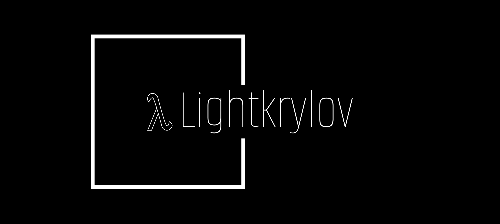
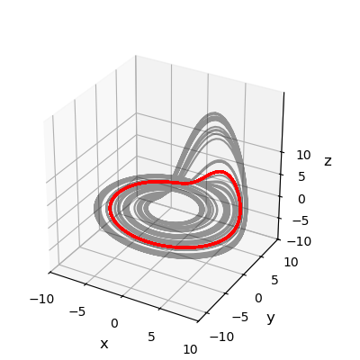

### Status

[](https://github.com/topics/fortran)
[](https://github.com/nekStab/LightKrylov/releases/latest)
[](https://github.com/nekStab/LightKrylov/actions)
[](https://nekstab.github.io/LightKrylov) 
[](https://codecov.io/gh/nekStan/LightKrylov)
[](https://github.com/loiseaujc/quadprog/commits/main)

Targeting large-scale linear algebra applications where the matrix $\mathbf{A}$ is only defined implicitly (e.g. through a call to a `matvec` subroutine), this package provides lightweight Fortran implementations of the most useful Krylov methods to solve a variety of problems, among which:

1. Eigenvalue Decomposition
   $$\mathbf{A} \mathbf{x} = \lambda \mathbf{x}$$

2. Singular Value Decomposition
   $$\mathbf{A} = \mathbf{U} \boldsymbol{\Sigma} \mathbf{V}^T$$

3. Linear system of equations
   $$\mathbf{Ax} = \mathbf{b}$$

Krylov methods are particularly appropriate in situations where such problems must be solved but factorizing the matrix $\mathbf{A}$ is not possible because:

- $\mathbf{A}$ is not available explicitly but only implicitly through a `matvec` subroutine computing the matrix-vector product $\mathbf{Ax}$.
- $\mathbf{A}$ or its factors (e.g. `LU` or `Cholesky`) are dense and would consume an excessive amount of memory.

Krylov methods are *iterative methods*, i.e. they iteratively refine the solution of the problem until a desired accuracy is reached. While they are not recommended when a machine-precision solution is needed, they can nonetheless provide highly accurate approximations of the solution after a relatively small number of iterations. Krylov methods form the workhorses of large-scale numerical linear algebra.

## Capabilities

`LightKrylov` leverages Fortran's `abstract type` feature to provide generic implementations of the various Krylov methods.
The only requirement from the user to benefit from the capabilities of `LightKrylov` is to extend the `abstract_vector` and `abstract_linop` types to define their notion of vectors and linear operators. `LightKrylov` then provides the following functionalities:

- Krylov factorizations : `arnoldi`, `lanczos`, `bidiagonalization`.
- Spectral analysis : `eigs`, `eighs`, `svds`.
- Linear systems : `gmres`, `cg`.
- Nonlinear system: `newton`.

To date, `LightKrylov` can handle `real` and `complex`-valued vectors and linear operators, using both single and double precision arithmetic.
This was made possible thanks to [`fypp`](https://github.com/aradi/fypp), a python powered Fortran meta programming utility.

### Examples

Some examples can be found in the `example` folder. These include:
- [Ginzburg-Landau]() : Serial computation of the leading eigenpairs of a complex-valued linear operator via time-stepping.
- [Laplace operator]() : Parallel computation of the leading eigenpairs of the Laplace operator defined on the unit-square.
- [Roessler system]() : Computation of an unstable periodic orbit embedded in the strange attractor of the system along with an OTD analysis of this orbit.

Alternatively, you can also look at [`neklab`](https://github.com/nekStab/neklab), a bifurcation and stability analysis toolbox based on `LightKrylov` and designed to augment the functionalities of the massively parallel spectral element solver [`Nek5000`](https://github.com/Nek5000/Nek5000).

| [**Ginzburg-Landau**]() | [**Laplace operator**]() | [**Roesler system**]() |
| :---------------------: | :----------------------: | :--------------------: |
|  | ADD FIGURE |  |

## Installation

Provided you have `git` installed, getting the code is as simple as:

```
git clone https://github.com/nekStab/LightKrylov
```

Alternatively, using `gh-cli`, you can type

```
gh repo clone nekStab/LightKrylov
```

### Dependencies

`LightKrylov` has a very minimal set of dependencies. These only include:

- a Fortran compiler,
- [`fpm`](https://github.com/fortran-lang/fpm) for building the code.

All other dependencies are directly handled by the Fortran Package Manage `fpm`.
To date, the tested compilers include:

- `gfortran 12` (Linux)
- `gfortran 13` (Linux, Windows, MacOS)
- `ifort` (Linux)
- `ifx` (Linux)

### Building with `fpm`

Provided you have cloned the repo, installing `LightKrylov` with `fpm` is as simple as

```
fpm build --profile release
```

To install it and make it accessible for other non-`fpm` related programs, simply run

```
fpm install --profile release
```

Both of these will make use of the standard compilation options set by the `fpm` team. Please refer to their documentation ([here](https://fpm.fortran-lang.org/)) for more details.

### Running the tests

To see if the library has been compiled correctly, a set of unit tests are provided in the `test` folder. Run the following command.

```
fpm test
```

If everything went fine, you should see

```
All tests successfully passed!
```

If not, please feel free to open an Issue.

### Running the examples

To run the examples:

```
fpm run --example
```

This command will run all of the examples sequentially. You can alternatively run a specific example using e.g.

```
fpm run --example Ginzburg-Landau
```

For more details, please refer to each of the examples.

## Contributing

### Current developers

`LightKrylov` is currently developed and maintained by a team of three:
- [Jean-Christophe Loiseau](https://loiseaujc.github.io/) : Assistant Professor of Applied maths and Fluid dynamics at [DynFluid](https://dynfluid.ensam.eu/), Arts et Métiers Institute of Technology, Paris, France.
- [Ricardo Frantz](https://github.com/ricardofrantz) : PhD in Fluid dynamics (Arts et Métiers, France, 2022) and currently postdoctoral researcher at DynFluid.
- [Simon Kern](https://github.com/Simkern/) : PhD in Fluid dynamics (KTH, Sweden, 2023) and currently postdoctoral researcher at DynFluid.

Anyone else interested in contributing is obviously most welcomed!

## Acknowledgment

The development of `LightKrylov` is part of an on-going research project funded by [Agence Nationale pour la Recherche](https://anr.fr/en/) (ANR) under the grant agreement ANR-22-CE46-0008. The project started in January 2023 and will run until December 2026.
We are also very grateful to the [fortran-lang](https://fortran-lang.org/) community and the maintainers of [`stdlib`](https://github.com/fortran-lang/stdlib), in particular to @perazz, @jalvesz and @jvdp1 for their awesome work on the `stdlib_linalg` module which greatly simplified the developlement of `LightKrylov`.

### Related projects

`LightKrylov` is the base package of our ecosystem. If you like it, you may also be interested in :
- [`LightROM`](https://github.com/nekStab/LightROM) : a lightweight Fortran package providing a set of functions for reduced-order modeling, control and estimation of large-scale linear time invariant dynamical systems.
- [`neklab`](https://github.com/nekStab/neklab) : a bifurcation and stability analysis toolbox based on `LightKrylov` for the massively parallel spectral element solver [`Nek5000`](https://github.com/Nek5000/Nek5000).
