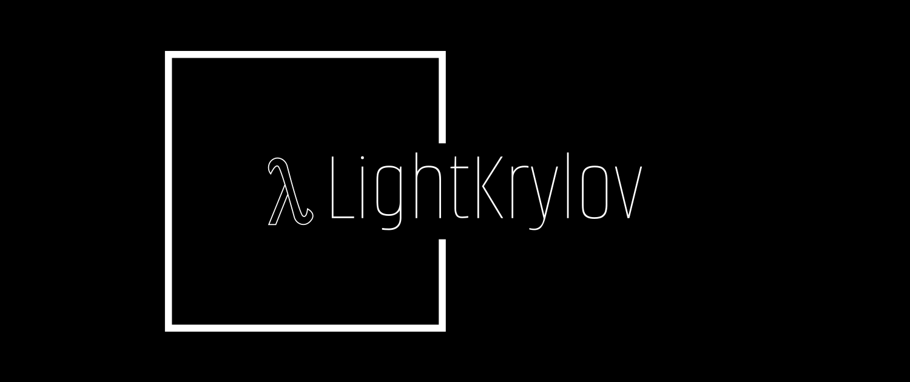

|                         **License**                          |                       **Build Status**                       | **Documentation** |
| :----------------------------------------------------------: | :----------------------------------------------------------: | :---------------: |
|  |  |                   |

# LightKrylov

Targeting large-scale linear algebra applications where the matrix $\mathbf{A}$ is only defined implicitly (e.g. through a call to a `matvec` subroutine), this package provides lightweight Fortran implementations of certain of the most useful Krylov methods to solve a variety of problems, among which:

1. Eigenvalue Decomposition
   $$\mathbf{A} \mathbf{x} = \lambda \mathbf{x}$$

2. Singular Value Decomposition
   $$\mathbf{A} = \mathbf{U} \boldsymbol{\Sigma} \mathbf{V}^T$$

3. Linear system of equations
   $$\mathbf{Ax} = \mathbf{b}$$

Krylov methods are particularly appropriate in situations where such problems must be solved but factorizing the matrix $\mathbf{A}$ is not possible because:

- $\mathbf{A}$ is not available explicitly but only implicitly through a `matvec` subroutine computing the matrix-vector product $\mathbf{Ax}$.
- $\mathbf{A}$ or its factors (e.g. `LU` or `Cholesky`) are dense and would consume an excessive amount of memory.

Krylov methods are *iterative methods*, i.e. they iteratively refine the solution of the problem until a desired accuracy is reached. While they are not recommended when a machine-precision solution is needed, they can nonetheless provide highly accurate approximations of the solution after a relatively small number of iterations. Krylov methods form the workhorses of large-scale numerical linear algebra.

## Capabilities

`LightKrylov` leverages Fortran's `abstract type` feature to provide generic implementations of the various Krylov methods.
The only requirement from the user to benefit from the capabilities of `LightKrylov` is to extend the `abstract_vector` and `abstract_linop` types to define their notion of vectors and linear operators. `LightKrylov` then provides the following functionalities:

- Krylov factorizations : `arnoldi_factorization`, `lanczos_tridiagonalization`, `lanczos_bidiagonalization`.
- Spectral analysis : `eigs`, `eighs`, `svds`.
- Linear systems : `gmres`, `cg`.

At the present time, none of the algorithms support Krylov-Schur restarting procedure although this is part of our plan for `LightKrylov v2.0`.

### Known limitations

For the sake of simplicity, `LightKrylov` only works with `real` or `double precision` data. While this might seem restrictive at first, consider that a complex-valued $n \times n$ linear system $\mathbf{Ax} = \mathbf{b}$ can always be rewritten using only real arithmetic as a $2n \times 2n$ real-valued system.
The primary reason to develop `LightKrylov` is to couple it with high-performance solvers in computational mechanics which often use exclusively real-valued data types. As such, we do not have any plan to natively support complex-valued linear operators or vectors.

### Examples

## Installation

## Help and support

## Contributing

### Current developers

### Bug reports and contributions

## References

### How to cite

### Related projects
