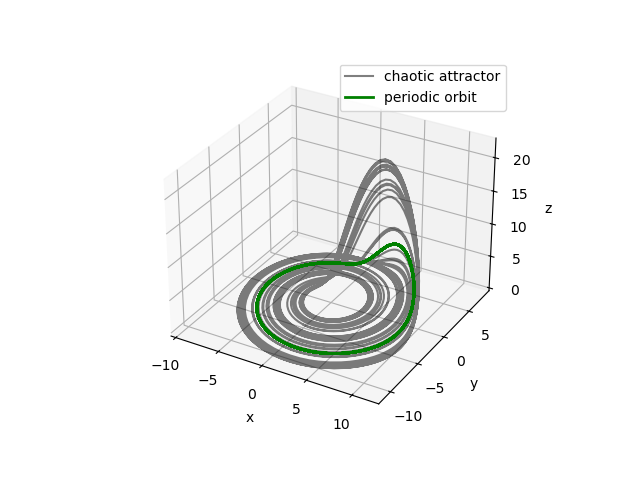
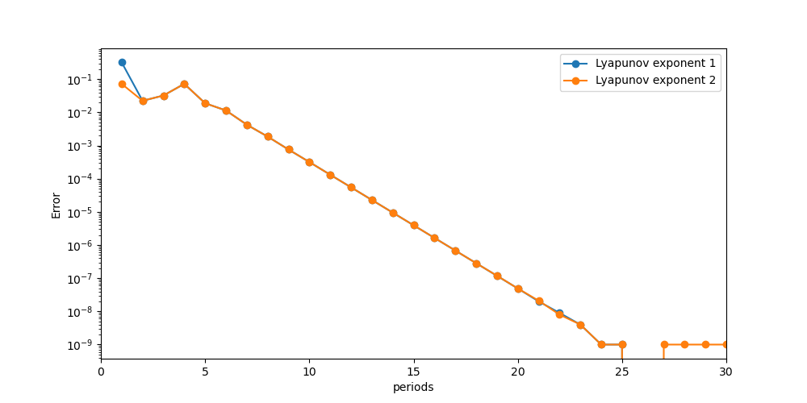
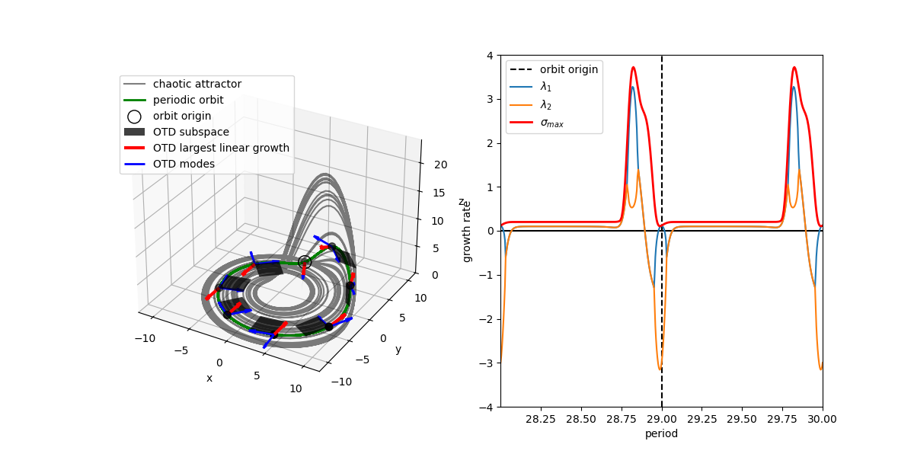

# **Periodic orbits and their stability on the chaotic Roessler attractor**

The Roessler system is a system of three non-linear ordinary differential equations given by
$$
\left\{
\begin{array}{l}
\dot{X} = -Y -Z \\
\dot{Y} = X + aY \\
\dot{Z} = b + Z(X - c)
\end{array}
\right.
$$
The three input parameters \( a, b, c \in \mathbb{R} \) define the systems regime. The Roessler system is a well-studied example of a continuous-time dynamical system that exhibits many features also found in more complicated systems of practical significance, namely stable and unstable fixed points, periodic orbits as well as chaotic behaviour, i.e. extreme sensitivity to initial conditions [[1](doi:10.1016/0375-9601(76)90101-8),[2](\https://ChaosBook.org)].

For the present example, we choose the standard input parameters
$$
\begin{aligned}
a = 0.2 \\
b = 0.2 \\
c = 5.7 \\
\end{aligned}
$$
for which the system dynamics give rise to the Roessler attractor with a fractal structure due to the chaotic behaviour of the system. To analyse the dynamics, we consider the linearised dynamics of the Roessler system around a point \(\mathbf{X} = (X,Y,Z)^T \), which are given by
$$
\left\{
\begin{array}{l}
\dot{x} = -y -z \\
\dot{y} = x + ay \\
\dot{z} = xZ + z(X - c)
\end{array}
\right.
$$
To simplify notation, we will write the nonlinear and linear dynamics as \( \dot{\mathbf{X}} = F(\mathbf{X}) \) and \( \dot{\mathbf{x}} = f(\mathbf{x}) = \mathbf{J} \: \mathbf{x} \), respectively, where the linear operator \( \mathbf{J} \) (also called Jacobian) encapsulates the above linear dynamics.

In the following, we will illustrate the techniques to compute periodic orbits of dynamical system using the iterative Newton-Krylov fixed-point iteration and different methods to analyse their local and global stability, namely the computation of the eigenvalues of the monodromy matrix and Lyapunov exponents as well as the Optimally Time-Dependent mode framework.

**Newton-Krylov fixed-point iteration -** A fixed point \(\mathbf{X}^* \) of a dynamical system is an equilibrium point that satisfies \( \dot{\mathbf{X}}^* = 0 \). Periodic orbits are a second kind of equilibrium point that are characterised by repeating dynamics with a constant period \(T\) such that \( \mathbf{X}(t + T) = \mathbf{X}(t) \), which can also be seen as fixed points of the forward map \( \mathbf{\Phi}_T \) defined as 
$$
\mathbf{\Phi}_T = \int_0^T F(\mathbf{X}(t)) \: d t .
$$

The Newton-Krylov fixed-point iteration is a Jacobian-free variant of the classical Newton-Raphson root-finding algorithm that, starting from an initial guess \( \mathbf{X}_0 \) for the root of the nonlinear function \( F(\mathbf{X}) \), iteratively improves the guess using the rule
$$
\mathbf{X}_{i+1} = \mathbf{X_i} - \mathbf{J}^{-1} F(\mathbf{X_i}) .
$$

In order to apply the Newton-Raphson method to find periodic orbits, the unknown orbit period \(T\) is included in the state vector \( \mathbf{X}_T (X,Y,Z,T)^T \) together with a new constraint to have a fully determined system and the system Jacobian \( \mathbf{J} \) is replaced by the Monodromy operator \( \mathbf{M}_T \), which is the linearisation of the forward map \( \mathbf{\Phi}_T \) about a given trajectory and is computed as
$$
\mathbf{M}_T = \int_0^T \mathbf{J}(t) \: dt .
$$

In practical applications, the Jacobian and Monodromy operators, if they are known explicitly, are never assembled or otherwise are only available via time-stepper functionalities. In order to extend the Newton-Raphson fixed-point iteration to these cases, we move to the Newton-Krylov fixed point iteration that replaces the direct inversion of the system Jacobian with Krylov-based approximations of the action of the linear operators. The system Jacobian \( \mathbf{J}_T \) that needs to be inverted at each Newton step becomes
$$
\mathbf{J}_T = \begin{pmatrix}
    \mathbf{M}_T - \mathbf{I} & F^T(\mathbf{\Phi}_T(\mathbf{X})) \\
    F^T(\mathbf{X}) & 0
\end{pmatrix} .
$$
In most applications in fluid mechanics, the discretisation produce systems of very high dimension so that the Newton-Krylov iteration is the only viable option for the computation of periodic orbits. For details and applications of the Newton-Krylov method, the interested reader is refered to [[3](https://doi.org/10.1016/j.jcp.2004.04.018),[4](https://doi.org/10.1017/S0022112007005459),[5](https://doi.org/10.1063/1.3009874),[6](https://doi.org/10.1115/1.4056808)] and the references therein.

**Numerical setup -** In order to analyse the linear and nonlinear dynamics of the Roessler system, we extend the `abstract_system_rdp` type together with an integrator for both the linear and nonlinear dynamics around a given nonlinear trajectory using a Runge-Kutta class provided by [`rklib`](https://github.com/jacobwilliams/rklib).

```fortran
subroutine combined_rhs(me, t, x, f)
    ! Time-integrator.
    class(rk_class), intent(inout)             :: me
    ! Current time.
    real(kind=wp)  , intent(in)                :: t
    ! State vector.
    real(kind=wp)  , dimension(:), intent(in)  :: x
    ! Time-derivative.
    real(kind=wp)  , dimension(:), intent(out) :: f
 
    call nonlinear_roessler(            x(:npts), f(:npts))     ! nonlinear dynamics
    call    linear_roessler(x(npts+1:), x(:npts), f(npts+1:))   ! linear dynamics about current point
     
    return
end subroutine combined_rhs
```

**Computation of periodic orbits of the Roessler system -** In order to apply the Newton-Krylov formalism to the Roessler system, we define the nonlinear system `roessler_upo()`

```fortran
sys_jac = roessler_upo()
sys_jac%jacobian = jacobian()
sys_jac%jacobian%X = bf
```

where `jacobian` is a linear operator (extended from the `abstract_linop_rdp` type) for the Newton-Krylov step calling the `combined_rhs` integrator and `bf` is the initial guess \( \mathbf{X}_0 \) for the periodic orbit.

```fortran
subroutine linear_map(self, vec_in, vec_out)
    ! Linear Operator.
    class(jacobian), intent(inout) :: self
    ! Input vector.
    class(abstract_vector_rdp), intent(in)  :: vec_in
    ! Output vector.
    class(abstract_vector_rdp), intent(out) :: vec_out

    ! Time-integrator.
    type(rks54_class)           :: combined_roessler
    real(wp)                    :: dt = 1.0_wp
    real(wp)                    :: period
    real(wp), dimension(2*npts) :: pos_in, pos_out
    type(state_vector)          :: vec

    select type (vec_in)
    type is (state_vector)
        select type (vec_out)
        type is (state_vector)
            ! Get the state.
            call get_position(self%X, pos_in(:npts))
            call get_period(self%X, period)
            call get_position(vec_in, pos_in(npts + 1:))
            ! Initialize integrator.
            call combined_roessler%initialize(n=2*npts, f=combined_rhs)
            ! Evaluate:
            ! 1. F(X)
            ! 2. exp(tau*J) @ dx
            call combined_roessler%integrate(0.0_wp, pos_in, dt, period, pos_out)
            ! Pass-back the state.
            call set_position(pos_out(npts + 1:), vec_out)

            ! Evaluate [ exp(tau*J) - I ] @ dx.
            call vec_out%sub(vec_in)

            ! Evaluate f'(X(T), T) * dT and add it to the position residual
            call compute_fdot(pos_out(:npts), vec)
            call vec_out%axpby(vec_in%T, vec, 1.0_wp)

            ! Evaluate f'(X(0), 0).T @ dx and add phase condition
            call compute_fdot(pos_in(:npts), vec)
            vec_out%T = vec_in%dot(vec)
        class default
            call stop_error("The intent [OUT] argument 'vec_out' must be of type 'state_vector'", this_module, 'linear_map')
        end select
    class default
        call stop_error("The intent [IN] argument 'vec_in' must be of type 'state_vector'", this_module, 'linear_map')
    end select
end subroutine linear_map
```

<div style="text-align:center;">
    
    </br>
    <b>Figure: </b> Representation of the chaotic Roessler attractor together with the periodic orbit.
</div>

The fixed point of the forward map is then found with the Newton-Krylov method using the iterative GMRES algorithm to solve the linear system involving the Jacobian.

**Stability analysis of the periodic orbit via the Optimally Time-Dependent modes -** In order to analyse the stability properties of the periodic orbit, we can use the Optimally Time-Dependent (OTD) Framework which is a numerically stable algorithm to compute an orthonormal basis of a linear subspace of the tangent space to a nonlinear trajectory spanning the most unstable directions [[7](https://doi.org/10.1098/rspa.2015.0779)]. This framework is particularly suited for the analysis of periodic orbits and other time-dependent trajectories since, once the basis is aligned with the most unstable subspace, it optimally follows it as the trajectory evolves. Once this time-dependent orthonormal basis \( \mathbf{Q} \) of used-defined rank \( r \) is computed, the full linearised dynamics \( \mathbf{J} \) can be projected onto the subspace to obtain the reduced operator \( \mathbf{J}_r = \mathbf{Q}^T \mathbf{J} \mathbf{Q} \) containing the dominant dynamics. The theory and implementation of the OTD framework is not reported here for the sake of conciseness. The interested reader is refered to [[7](https://doi.org/10.1098/rspa.2015.0779)] for the original paper presenting the method and [[8](https://doi.org/10.1137/18M1212082)] and [[9](https://doi.org/10.1017/jfm.2021.743)] for extensions and an application to fluid mechanics, respectively.

As the OTD basis converges to and follow the most unstable linear subspace tangent to the trajectory, they are ideally suited for the computation of the Lyapunov exponents, which are often used to characterise the chaotic behaviour of strange attractors. In order to compute the Lyapunov exponents, we integrate the leading eigenvalues of the reduced operator over time [[8](https://doi.org/10.1137/18M1212082)]. In this example, we initialise the 2-dimensional OTD basis with random orthonormal vectors and evolve it along the periodic orbit measuring the Lyapunov exponents at each period. As the OTD basis exponentially aligns with the invariant periodic tangent space along the periodic orbit, the approximation of the Lyapunov exponents improves, converging to the reference values from [[2](https://chaosbook.org/extras/simon/Roessler.html)].

<div style="text-align:center;">
    
    </br>
    <b>Figure:</b> Convergence history of the 2 Lyapunov exponents computed using the OTD basis compared to the reference values [2]. Note that the reference values are known only to 9 digits of precision which is reached after 24 periods.
</div>

From the reduced operator we can compute the instantaneous eigenvalues of the reduced operator \( \mathbf{J}_r \) and the symmetrised reduced operator \( \mathbf{J}_{sym} = 0.5(\mathbf{J} + \mathbf{J}^T) \) measuring modal and nonmodal growth potential, respectively. Projecting the OTD basis onto the eigenvectors of \( \mathbf{J}_r \) yields physically meaningful directions in phase space called OTD modes. 

<div style="text-align:center;">
    
    </br>
    <b>Figure:</b> The left panel depicts the chaotic Roessler attractor together with the periodic orbit (traversed in anticlockwise direction). At a few points along the orbit, the converged OTD subspace is plotted (grey surfaces) with the OTD modes (blue arrows) and the direction of maximum linear growth in the OTD subspace (red). The right panel shows the evolution over two periods of the growth rate of the eigenvalues and the numerical abscissa of the converged reduced operator along the invariant periodic tangent space. The vertical dashed line corresponds to the empty circle in the left panel for easier orientation.
</div>

From the root directory of `LightKrylov`, you can run this example by typing the following command:

```bash
fpm run --example Roessler
```

Then `python plot_roessler.py` in the `example/roessler` directory will produce the plots in this example.

## **References**

[1] O. E. Roessler. [*An Equation for Continuous Chaos*](doi:10.1016/0375-9601(76)90101-8). Physics Letters, 57A (5), 397–398, 1976.

[2] P. Cvitanovic, R. Artuso, R. Mainieri, G. Tanner and G. Vattay. [*Chaos: Classical and Quantum*](\https://ChaosBook.org). Niels Bohr Institute, Copenhagen 2020.

[3] J. Sánchez, M. Net, B. Garcıa-Archilla, & C. Simó. [*Newton–Krylov continuation of periodic orbits for Navier–Stokes flows*](https://doi.org/10.1016/j.jcp.2004.04.018). Journal of Computational Physics, 201(1), 13-33., 2004.

[4] D. Viswanath. [*Recurrent motions within plane Couette turbulence*](https://doi.org/10.1017/S0022112007005459). Journal of Fluid Mechanics, 580, 339-358, 2007.

[5] Y. Duguet, C. C. T. Pringle, R. R. Kerswell, [*Relative periodic orbits in transitional pipe flow*](https://doi.org/10.1063/1.3009874). Physics of Fluids, 20(11), 114102, 2008.

[6] R. A. Frantz, J.-C. Loiseau, & J.-C. Robinet. [*Krylov methods for large-scale dynamical systems: Application in fluid dynamics*](https://doi.org/10.1115/1.4056808). Applied Mechanics Reviews, 75(3), 030802, 2008.

[7] H. Babaee & T. P. Sapsis. [*A minimization principle for the description of modes associated with finite-time instabilities*](https://doi.org/10.1098/rspa.2015.0779). Proc. R. Soc. London, Ser. A 472, 2016.

[8] A. Blanchard & T. P. Sapsis. [*Analytical description of optimally time-dependent modes for reduced-order modeling of transient instabilities*](https://doi.org/10.1137/18M1212082). SIAM J. Appl. Dyn. Syst. 18 (2), 1143–1162, 2019.

[9] J. S. Kern, M. Beneitez, A. Hanifi & D. S. Henningson. [*Transient linear stability of pulsating Poiseuille flow using optimally time-dependent modes.*](https://doi.org/10.1017/jfm.2021.743) J. Fluid Mech. 927, A6., 2021.
